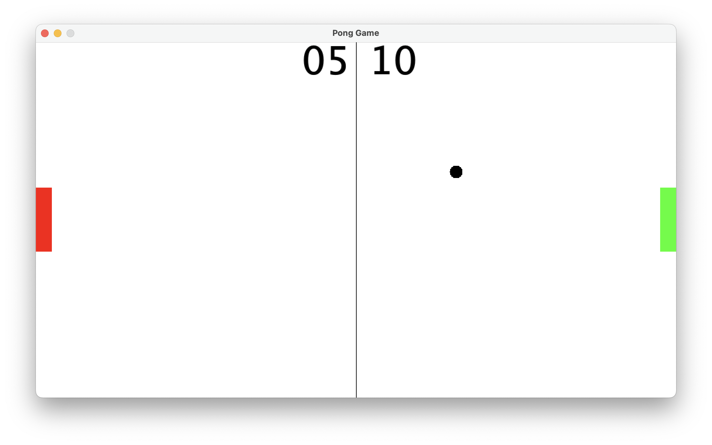

# 🏓 Ping Pong Game

Basic ping pong game using Java. The game is developed to have an understanding about the basics of java using swing package
Build as a Java Project in ***Visual Studio Code***

---

## Game Screenshot



---

## To execute

**Clone the repository**

```
git clone https://github.com/samakshtyagi/ping-pong-game.git
```

**Change directory**

```
cd ping-pong-game
```

**Execute java̛**

For Windows: run in cmd

```
cmd /c script.bat
```

For MacOs: run in terminal

```
bash script.bat
```

---


*To execute the java file, the system should have jdk installed as a requirement*
-------------------------------------------------------------------------------
